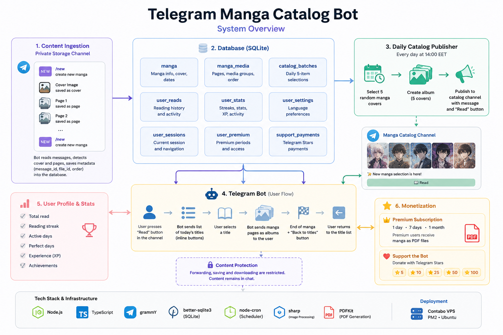
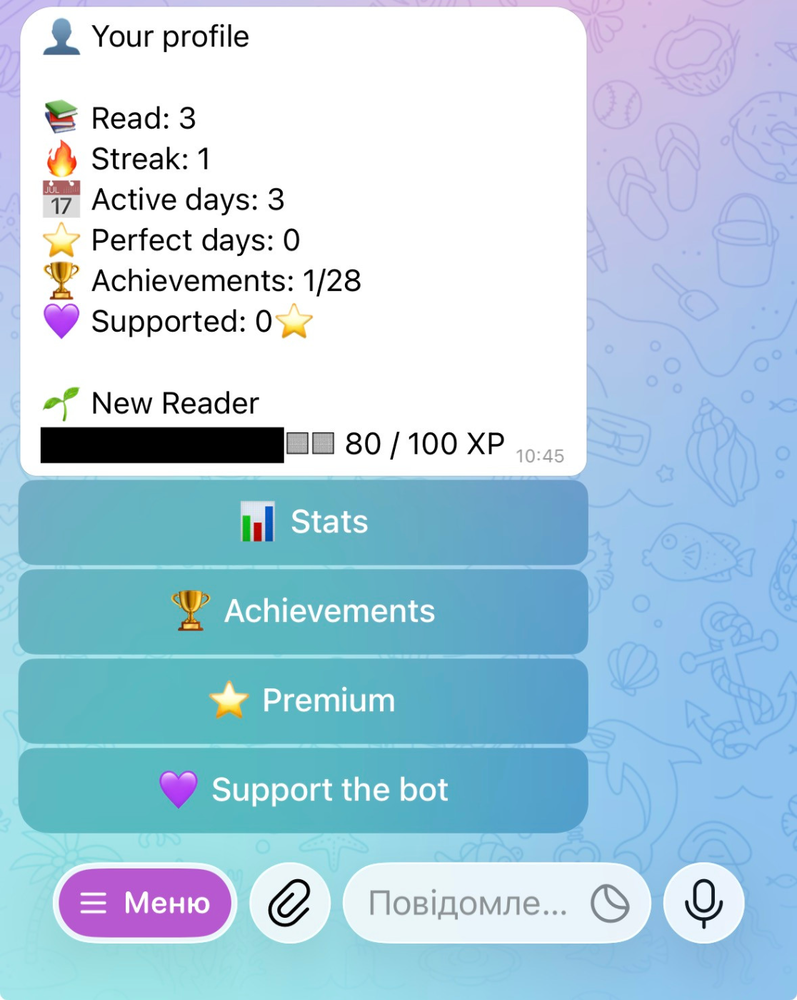
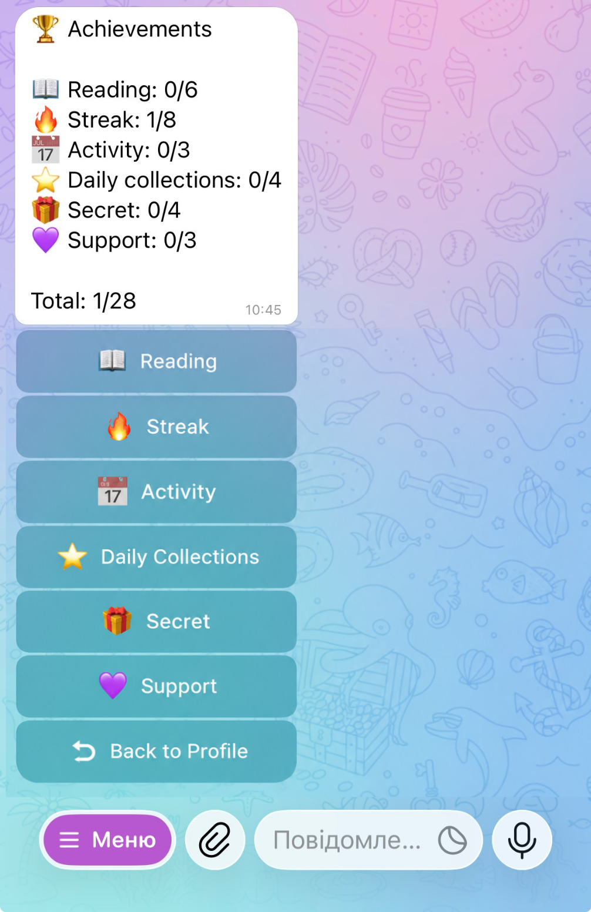
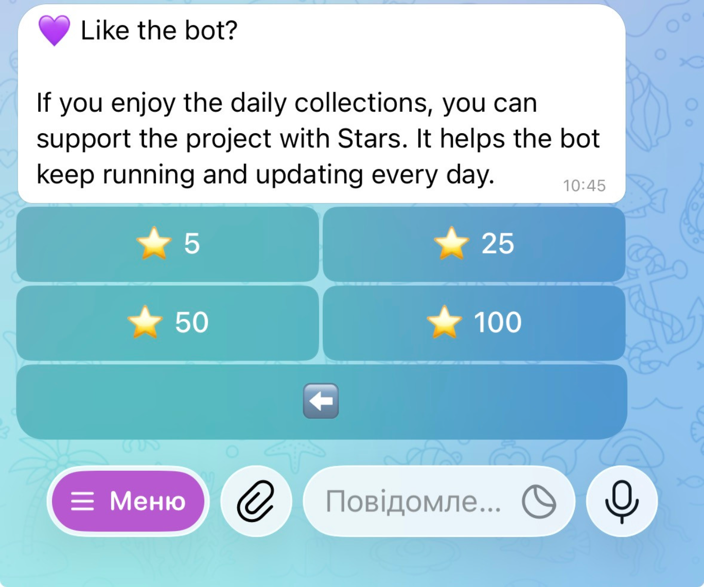

# Telegram Manga Catalog Bot


> A production-ready Telegram bot for automated manga publishing, catalog discovery, protected in-chat reading, reader statistics, achievements, subscriptions, and Telegram Stars payments.

---

## Overview

Telegram Manga Catalog Bot is a digital reading platform built around Telegram.

Content is uploaded through a private storage channel and automatically organized into individual manga titles. Every day, the bot selects five titles, publishes their covers as a curated collection in a public catalog channel, and provides readers with direct access through an interactive Telegram bot.

Readers can browse the daily selection, open individual titles, track their reading activity, unlock achievements, purchase premium access, and support the project using Telegram Stars.

This repository is a technical showcase. The production source code and content storage channels are private.

---

## Key Features

- Automated manga ingestion through a private Telegram channel
- Tag-based creation of new manga records
- Automatic cover and page detection
- Daily catalog publication with five selected titles
- Telegram media-group publishing
- Interactive title selection through inline buttons
- Protected in-chat reading experience
- Persistent access to previously delivered content
- Reader profile with activity statistics
- Reading streaks and active-day tracking
- Achievement system
- Multi-language interface
- Premium subscriptions for 1 day, 7 days, or 1 month
- PDF generation for premium readers
- Telegram Stars donations and subscription payments
- Automated deployment on a Contabo VPS

---

## System Overview



---

## How It Works

### 1. Content Ingestion

Content is uploaded manually to a private Telegram storage channel.

A special `new` tag starts the creation of a new manga entry:

1. A new database record is created.
2. The next uploaded image is assigned as the manga cover.
3. All following images are stored as manga pages.
4. Uploads continue to belong to the same manga until the next `new` tag is received.

The database stores Telegram message identifiers, file identifiers, media types, group identifiers, and page order.

---

### 2. Daily Catalog Publishing

Every day at **14:00 Eastern European time**, the scheduler:

1. Selects five manga covers.
2. Creates a Telegram album containing the selected covers.
3. Publishes the album to the catalog channel.
4. Adds a message announcing a new manga selection.
5. Attaches a **Read** button leading to the bot.

Each published selection is stored as a catalog batch so the bot can restore the correct title list later.

---

### 3. Reading Flow

When a reader presses the **Read** button:

1. Telegram opens the private bot chat.
2. The bot displays the titles included in the selected catalog batch.
3. Each title is presented as an interactive button.
4. After selecting a title, the bot delivers its pages as Telegram media albums.
5. At the end, the reader receives an **End** message and a **Back to titles** button.
6. Pressing the button restores the current title selection.

Delivered media remains available in the private chat.

Content protection settings prevent standard forwarding and saving actions.

---

### 4. Reader Profile

Every reader has a personal profile containing activity statistics such as:

- total titles read;
- current reading streak;
- longest reading streak;
- number of active days;
- perfect reading days;
- experience points;
- unlocked achievements;
- total Telegram Stars used to support the project.

Reading events are stored separately, allowing the bot to calculate statistics without duplicating completed titles.

---

### 5. Premium Access

Premium access can be purchased for:

- 1 day;
- 7 days;
- 1 month.

Premium readers receive manga as generated PDF documents instead of separate Telegram media albums.

PDF files are created dynamically from stored manga pages using PDFKit and image-processing utilities.

Premium access is tracked using activation and expiration timestamps.

---

### 6. Telegram Stars Support

Readers can support the project through Telegram Stars.

Available donation options include:

- 5 Stars;
- 10 Stars;
- 25 Stars;
- 50 Stars;
- 100 Stars.

Successful payments are recorded with the user ID, payment payload, number of Stars, and transaction timestamp.

---

## Tech Stack

### Backend

- Node.js
- TypeScript
- grammY
- Telegram Bot API

### Database

- SQLite
- better-sqlite3

### Media Processing

- Sharp
- PDFKit

### Automation

- node-cron
- Scheduled daily publishing

### Infrastructure

- Contabo VPS
- Ubuntu
- PM2 process manager
- Persistent SQLite storage

---

## Database Structure

The application uses a relational SQLite database.

### Content Management

| Table             | Purpose                                                            |
| ----------------- | ------------------------------------------------------------------ |
| `ingest_state`    | Tracks the current ingestion process and active manga              |
| `manga`           | Stores manga metadata, cover information, and publication dates    |
| `manga_media`     | Stores individual pages, media groups, file IDs, and reading order |
| `catalog_batches` | Stores the five-title collections published to the catalog         |

### Reader Data

| Table               | Purpose                                                    |
| ------------------- | ---------------------------------------------------------- |
| `user_settings`     | Stores interface language preferences                      |
| `user_sessions`     | Tracks the reader’s current catalog and sent messages      |
| `user_library`      | Stores titles saved to a reader’s personal library         |
| `user_access`       | Controls temporary access to individual titles             |
| `user_kept_titles`  | Stores permanently retained titles                         |
| `user_reads`        | Records completed reading activity                         |
| `user_stats`        | Stores aggregated statistics, streaks, XP, and active days |
| `user_achievements` | Stores unlocked achievements                               |

### Monetization

| Table              | Purpose                                     |
| ------------------ | ------------------------------------------- |
| `user_premium`     | Stores premium subscription periods         |
| `support_payments` | Records successful Telegram Stars donations |

---

## Architecture Highlights

### Telegram as Content Storage

Large media files are stored inside a private Telegram channel rather than duplicated inside the application database.

The database stores only the identifiers and metadata required to retrieve and organize the content.

This approach reduces local storage requirements and makes content ingestion possible directly through Telegram.

---

### Stateful Content Ingestion

The ingestion system maintains a persistent state containing:

- the current manga ID;
- whether the next image should be treated as a cover;
- the current page position.

Because this state is stored in SQLite, the ingestion process can continue correctly after an application restart.

---

### Ordered Media Delivery

Every manga page receives an explicit position value.

This ensures that media is delivered in the intended reading order even when Telegram messages belong to different media groups.

---

### Persistent Reader Sessions

The bot stores each reader’s current catalog batch and related message IDs.

This allows navigation buttons such as **Back to titles** to restore the correct daily selection instead of generating a new one.

---

### Dynamic PDF Generation

For premium readers, stored Telegram media is converted into a single PDF document.

The processing pipeline uses:

- Telegram file retrieval;
- Sharp for image processing;
- PDFKit for document generation;
- temporary server-side file handling.

---

### Achievement and Streak System

Reading activity is stored as individual events and summarized in a dedicated statistics table.

The system tracks:

- unique completed titles;
- daily reading activity;
- current and longest streaks;
- perfect days;
- experience points;
- achievement unlock conditions.

---

## Project Structure

```text
src/
├── db.ts
├── handlers.ts
├── index.ts
├── keyboards.ts
├── manga.ts
├── premium.ts
├── profile.ts
├── texts.ts
└── utils.ts
```

> The structure above represents the logical organization of the production application. The complete source code is maintained in a private repository.

---

## Screenshots

<p align="center">
  
  
  
</p>

---

## Deployment

The production bot is deployed on a Contabo VPS alongside another Telegram automation project.

The deployment includes:

- Ubuntu server environment;
- PM2 process management;
- automatic process restart;
- persistent SQLite database;
- scheduled daily catalog publication;
- environment-based configuration;
- private Telegram storage and catalog channels.

---

## Technical Highlights

- Stateful Telegram-based content ingestion
- Automated daily catalog generation
- Relational SQLite data model
- Protected media delivery
- Persistent navigation sessions
- Dynamic PDF generation
- Multi-language interface
- Reader activity analytics
- Achievement and streak engine
- Telegram Stars integration
- Time-based premium subscriptions
- Production VPS deployment

---

## Privacy and Source Code

The production source code is private because the application is actively deployed and connected to private storage infrastructure.

This public repository contains documentation, architecture diagrams, interface screenshots, and an overview of the main engineering decisions.

No private channel identifiers, bot tokens, user data, payment data, or production content are included.
